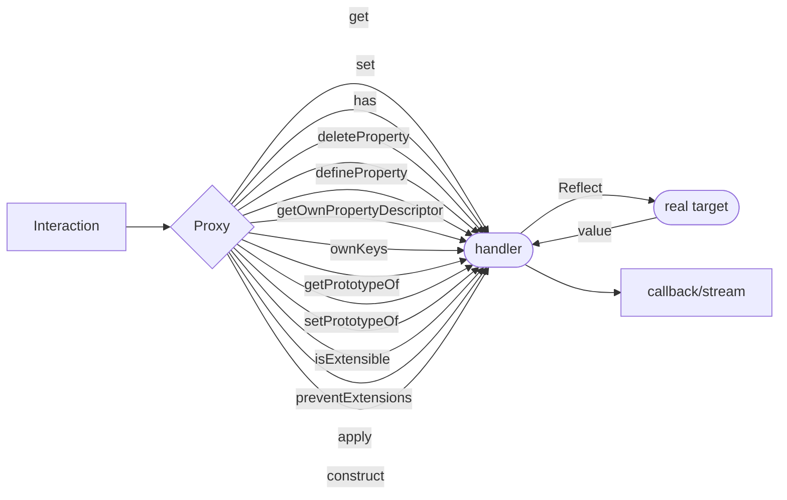
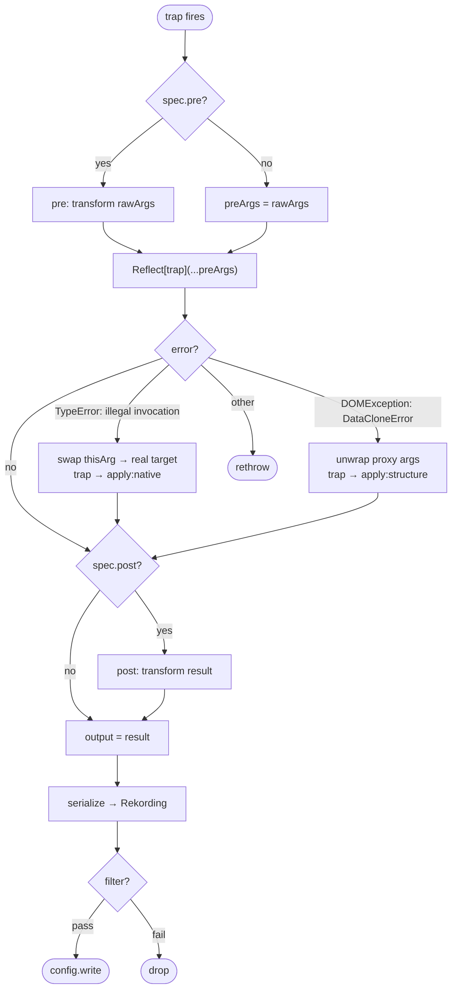
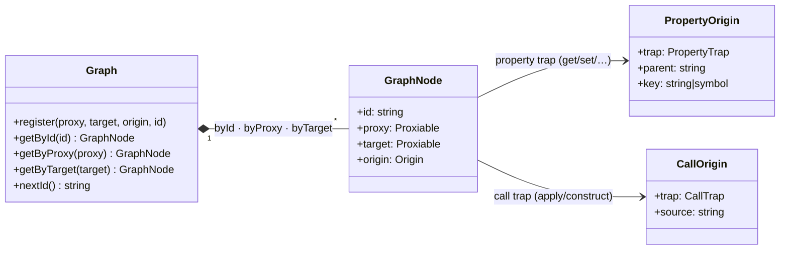

# Design notes

A record of what was tried before the current implementation, and why each approach was abandoned. Useful background for contributors wondering why certain decisions were made.

For a higher-level explanation of the final design, see the [How it works](README.md#how-it-works) section of the README.

---

## Proxy mechanics

A `Proxy` wraps a real target object. Every operation the caller performs on the proxy — property read, assignment, function call, construction — is intercepted by the JS engine and routed to the corresponding named trap. The trap calls `Reflect[trap]` to forward the operation to the real target and returns the result.

If no handler is defined for a trap, the JS engine forwards directly to the target — a Proxy with an empty handler is fully transparent.

---

## Approaches tried

### Path-tracking stream recorder

Maintained path arrays alongside objects in a WeakMap, emitted stream records with kind, path, and timestamp.

**Problem:** No stable proxy identity — the same object returned different proxies on repeated access. Path arrays duplicated across WeakMaps became inconsistent. No parent-child relationship surveyable from records alone.

**Carried forward:** Stream-based output option, path reconstruction concept.

---

### Lightweight callback recorder

Minimal event-per-trap model: id, timestamp, kind, path, params, result stored per event.

**Problem:** Too simple. Results stored by-value risked circular references. Path arrays rebuilt on every trap fire. Events disconnected from each other — no parent chain.

**Carried forward:** Nothing significant.

---

### Numeric IDs + child-sink pattern

Each proxy got a numeric ID; child logs created via `Array.slice(0, 0)` to respect `Symbol.species`. Tracked parent-child via ID references.

**Problem:** Numeric IDs non-portable across serialization boundaries. Results stored directly in logs risked circular references. No trap filtering. The array child-sink pattern was obscure and fragile.

**Carried forward:** Structured Origin concept (trap/parent/key mapping), per-proxy metadata pattern.

---

### Observation modes + serialization

Introduced three observation modes (group/explicit/key-first) and `{ $proxy: id }` serialization tags. Trap filtering. Closure-based wrapping for recursive proxy creation.

**Problem:** `defineProperty` spec forced `configurable/enumerable/writable=true`, breaking `Array.push`. Key-first mode was incomplete. Origin simplified to `string | symbol`, losing the trap type information needed for replay.

**Carried forward:** `{ $proxy: id }` serialization strategy, origin extraction via spec functions, trap filtering concept.

---

### Minimal origin + direct recording

Simplified origin to `string | symbol | null`, smaller memory footprint, inline wrap functions in specs.

**Problem:** Records not JSON-serializable due to circular reference risk. Origin lost trap type information entirely. `getAncestors()` broke when proxies were GC'd — the implementation stored the parent proxy itself rather than its ID, preventing collection.

**Carried forward:** Origin extraction pattern, memory footprint discipline.

---

## What made it into the final design

The trap handler in `makeProxy` follows this flow for every intercepted operation:

| Decision | Rationale |
|---|---|
| Structured `Origin { trap, parent, key }` | Survives GC; distinguishes trap types; reconstructible from records alone |
| `{ $proxy: id }` serialization tags | JSON-safe, no circular reference risk, resolvable via `getProxyById` |
| Stream or callback output | Both covered: streaming for persistence, callback for in-process inspection |
| Origin extraction via spec pre/post hooks | Keeps trap handler generic; per-trap concerns stay in one place |
| `only` filter | Covers real use cases with minimal API surface (replaces 3-mode system) |
| Proxy stability guarantee | Same object → same proxy, regardless of how many times it is accessed |
| Native slot detection + bind cache | Allows `Map`, `Set`, `WeakMap`, `WeakSet`, `Date` to be proxied and recorded; probe runs once per prototype, bind cache maintains stability for method results |
| No double-wrapping guard | Prevents infinite loops when proxied values are passed back into proxied functions |

## What was abandoned and why

| Abandoned | Reason |
|---|---|
| Path arrays per object | Replaced by origin chain walking — more compact, reconstructible from records |
| Numeric IDs | Switched to `#`-prefixed strings — human-readable and JSON-safe |
| Direct object storage in logs | Full serialization required for streaming, logging, and replay |
| `Symbol.species` child-sink | Unnecessary complexity; WeakMap per-proxy metadata is more reliable |
| Three observation modes | Single `only` allowlist covers real use cases with less API surface |
| Origin as `string \| symbol` | Full Origin struct needed to distinguish trap types during replay |
| Unserializable records | Non-starter for the stream output use case |

---

## Notable additions with no predecessor

Each `create()` call produces one `Graph`, which holds three lookup indices over `GraphNode` entries. Every node links a proxy to its original target and its `Origin` — the record of how the proxy was reached:

`origin` is `null` for the root node (the value passed directly to `create()`).

**Graph class** — Session-scoped registries (`byId`, `byProxy`, `byTarget`) per `create()` call, making each proxied tree GC-eligible and self-contained. Earlier approaches used module-level maps, causing memory leaks under repeated use.

**Promise special case** — Native Promise methods check for the `[[PromiseState]]` internal slot and throw if `this` is a Proxy. flugrekorder returns a new Promise that proxies the settled value instead, maintaining the stability guarantee across async boundaries.

**Native internal slot detection** — ECMAScript built-ins such as `Map`, `Set`, `WeakMap`, `WeakSet`, and `Date` store state in internal slots that a Proxy cannot carry. Accessing their properties or calling their methods with `this` as a Proxy throws `TypeError`. flugrekorder probes each object's prototype chain once (cached per prototype, result discarded safely via a write-suppressing blank Proxy) to detect this boundary. For detected types, the `get` trap swaps the receiver to the real target (fixing getter-based checks like `Map.prototype.size`) and binds method results to the real target before wrapping (fixing apply-level checks like `Map.prototype.get`). A stable bind cache ensures the same bound function proxy is returned on every access, preserving the proxy stability guarantee.

**`wrapKnown` vs `wrap`** — Dual-mode wrapping prevents unbounded proxy creation when plain data is passed to proxied functions. `wrap` creates new proxies freely (for results); `wrapKnown` only wraps values already in the graph (for call arguments).

**`isECMABuiltin` guard and the C++ binding crash** — The native slot detection described above identifies both ECMAScript built-ins (`Map`, `Set`, `Date`, …) and Node.js C++ bindings (`TCP`, `ConnectionsList`, `HTTPParser`, …) as slot-bearing. The two kinds behave differently at the boundary: ECMAScript built-ins perform a JavaScript-level type check before touching their internal fields, so they throw a catchable `TypeError` when called through a Proxy; C++ bindings skip the JS check entirely and call `v8::Object::GetAlignedPointerFromInternalField` directly, which fatally aborts the process if the object has no internal fields — as a Proxy does not.

The crash had three contributing paths. The primary one was subtle: `Reflect.set(target, key, value, proxyReceiver)` routes through the `defineProperty` trap when the receiver is a Proxy. The existing `defineProperty.pre` was wrapping all descriptor values unconditionally, so `this._handle = new TCP()` inside `net.Server.listen()` — with `this` as the server proxy — stored a Proxy of the TCP handle back into the real target. Native C++ code later received that Proxy as an argument, called `Unwrap<T>()` without a prior JS type check, and crashed. The other two paths were the `get.post` hook recursively proxying C++ handle objects returned from property accesses, and the `apply` trap forwarding the Proxy as `this` to native methods.

`isECMABuiltin` distinguishes the two kinds by explicit allowlist (Promise, Map, Set, WeakMap, WeakSet, Date, RegExp, ArrayBuffer, TypedArrays). Everything slot-bearing that is not on the allowlist is treated as an unsafe C++ binding and returned or stored unwrapped. Four traps carry the guard: `get.post`, `set.pre`, `defineProperty.pre`, and `getOwnPropertyDescriptor.post`.

Two observable artefacts accompany the fix. `apply:native` is emitted instead of `apply` when a method call throws `"Illegal invocation"` — the `this`-as-Proxy rejection that JS-level C++ wrappers surface — and the call is retried with the real target as receiver. `{ $unwrap: { $proxy: id } }` appears in serialized args wherever a raw target (known to the graph but passed unwrapped across the native boundary) is recorded in place of its proxy.
